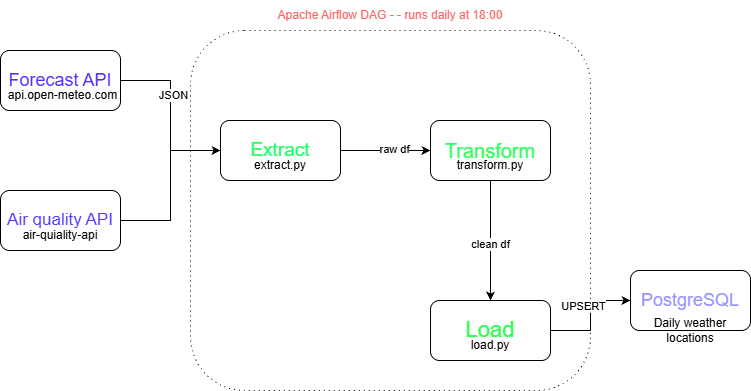
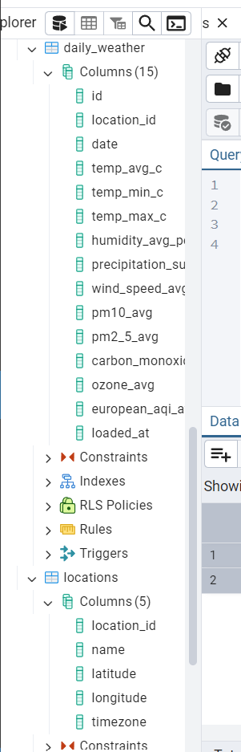

# NYC & Tbilisi Weather + Air Quality ETL Pipeline

An end-to-end ETL pipeline that extracts hourly weather and air quality data
from the Open-Meteo API, transforms it into daily metrics with pandas, and
loads the result into PostgreSQL.

## What Problem This Solves

Weather and air quality APIs return nested hourly JSON. That format is useful
for APIs, but not ideal for analytics. This project turns raw hourly responses
into a clean relational table that can be queried, reloaded safely, and
scheduled as a daily data pipeline.

## Architecture



| Layer | Tool |
|---|---|
| Extract | Python `requests` + Open-Meteo API |
| Transform | `pandas` daily aggregation |
| Load | `psycopg2` UPSERT into PostgreSQL |
| Database | PostgreSQL in Docker |
| Scheduling | Airflow DAG included in `dags/weather_dag.py` |
| Testing | `pytest` transform tests |

## Cities Tracked

| City | Latitude | Longitude | Timezone |
|---|---:|---:|---|
| Tbilisi, Georgia | 41.7151 | 44.8271 | Asia/Tbilisi |
| New York, USA | 40.7128 | -74.0060 | America/New_York |

## Project Structure

```text
weather-etl-pipeline/
├── dags/
│   └── weather_dag.py
├── data/
│   └── sample_output.csv
├── docs/
│   └── weatherapp.drawio.png
├── sql/
│   └── schema.sql
├── src/
│   ├── extract.py
│   ├── transform.py
│   ├── load.py
│   └── pipeline.py
├── tests/
│   └── test_transform.py
├── docker-compose.yml
├── requirements.txt
└── README.md
```

## How To Run

### 1. Create and activate a virtual environment

```powershell
python -m venv .venv
.\.venv\Scripts\activate
pip install -r requirements.txt
```

### 2. Start PostgreSQL

```powershell
docker compose up -d postgres
```

PostgreSQL connection details:

```text
Host: 127.0.0.1
Port: 55432
Database: weather_etl
Username: weather_user
Password: weather_password
```

### 3. Run the ETL pipeline

```powershell
.\.venv\Scripts\python.exe src\pipeline.py
```

### 4. Query the loaded data

```powershell
docker exec weather_etl_postgres psql -U weather_user -d weather_etl -c "SELECT l.name, d.date, d.temp_avg_c, d.pm2_5_avg, d.european_aqi_avg FROM daily_weather d JOIN locations l ON d.location_id = l.location_id ORDER BY d.date DESC, l.name;"
```

## Sample Output

| city | date | temp_avg_c | pm2_5_avg | european_aqi_avg |
|---|---|---:|---:|---:|
| New York | 2026-07-14 | 27.80 | 17.36 | 51.1 |
| Tbilisi | 2026-07-14 | 26.81 | 10.44 | 26.5 |

The full sample row format is available in `data/sample_output.csv`.

## Tests

```powershell
.\.venv\Scripts\python.exe -m pytest
```

The tests validate that hourly weather and air quality data is aggregated into
one complete daily row, and that incomplete days are rejected.

## Airflow

`dags/weather_dag.py` defines a daily DAG called `weather_etl_daily` that calls
`run_pipeline()`.

This repository currently runs PostgreSQL with Docker Compose. The Airflow DAG
is included so the project shows how the pipeline can be scheduled in an Airflow
environment, but Airflow itself is not started by the current
`docker-compose.yml`.

## Key Engineering Decisions

**Idempotent loads**: `daily_weather` has a unique constraint on
`(location_id, date)`, and `load.py` uses UPSERT logic. Re-running the pipeline
updates an existing row instead of creating duplicates.

**Separation of concerns**: extraction, transformation, loading, orchestration,
schema, and tests live in separate files.

**Complete-day logic**: the transform step only accepts full 24-hour days, which
prevents partial current-day API data from entering the daily table.

## Data Source

Weather and air quality data is provided by
[Open-Meteo](https://open-meteo.com/), which does not require an API key for
this use case.
